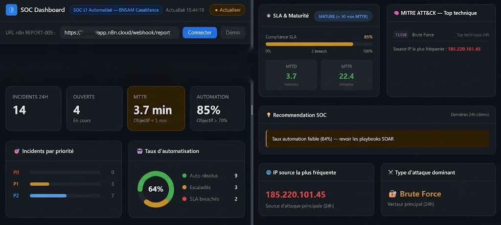

<div align="center">

# 👋 [FIRST NAME] [LAST NAME]

### Cybersecurity Student | Aspiring SOC Analyst | Blue Team | Threat Intelligence


[LinkedIn](https://linkedin.com/in/[your-linkedin]) · [Email](mailto:[your-email]) 

</div>

---

## 📑 Table of Contents

- [About](#-about)
- [Key Areas of Interest](#-key-areas-of-interest)
- [Projects](#️-projects)
  - [Academic Projects](#academic-projects)
  - [Personal Security Labs](#personal-security-labs)
- [Certifications](#-certifications)
- [Hands-on Platforms](#-hands-on-platforms)
- [Technical Skills](#️-technical-skills)
- [Current Learning](#-current-learning)
- [Repository Structure](#-repository-structure)
- [Contact](#-contact)
- [License](#-license)

---

## 🎯 About

I'm a cybersecurity student building a solid foundation toward a career as a
**SOC Analyst / Blue Team practitioner**. My approach combines academic
projects, hands-on labs, and industry certifications to develop practical
skills in detection, incident response, and threat intelligence — rather
than stopping at theory.

This repository is a working portfolio: each project reflects a specific
skill I wanted to build, from designing a SOC automation pipeline to
understanding attacker techniques well enough to detect them. I'm currently
looking for a **SOC / Security Analyst / Threat Intelligence internship**
where I can apply and grow these skills in a real operational environment.

## 🧭 Key Areas of Interest

`SOC Operations` · `Incident Response` · `Threat Intelligence` · `Digital Forensics (DFIR)` · `Network Security` · `Detection Engineering` · `Security Automation (SOAR)`

---

## 🗂️ Projects

Each project follows the same structure: **Objective → Features → Technologies.**

### Academic Projects

#### 1. [SIEM/SOAR Platform — SOC Automation with n8n](https://github.com/[github-username]/siem-soar-n8n)

*Academic project — ENSAM Casablanca*


*dashboard screenshot / workflow diagram*

**Objective:** Simulate a functioning SOC pipeline — from log ingestion to
automated incident response — using a low-code orchestration engine.

**Features:**
- Brute-force detection via a persisted state-based detection model (PostgreSQL)
- Incident deduplication and correlation before escalation
- Automated enrichment of indicators through external threat intel APIs
- Human-in-the-loop validation (OTP confirmation) before any remediation action
- Simulated containment actions (firewall block, host isolation)
- SLA monitoring with automatic escalation
- Metrics dashboard (MTTD / MTTR)

**Technologies:**
`n8n` · `PostgreSQL / Supabase` · `Twilio API` · `VirusTotal API` · `AbuseIPDB API` · `MITRE ATT&CK`

---

#### 2. [CyberTrace CTI — Threat Intelligence Platform](https://github.com/[github-username]/cybertrace-cti)

*Academic project — team of 4 students, supervised by [SUPERVISOR NAME], [DATE]*


*Add: class diagram / UI screenshot*

**Objective:** Build a platform to manage and correlate threat intelligence
data (indicators, threat actors, APT groups) mapped to a recognized
adversary framework.

**Features:**
- IOC management (IP, hash, domain, email)
- Threat actor and APT group profiling
- Campaign simulation based on MITRE ATT&CK
- Layered architecture with dedicated service/repository/security modules
- Unit test coverage (JUnit)

**Technologies:**
`Java 17` · `Maven` · `JUnit` · `MITRE ATT&CK`

---

#### 3. [Secure Routing — Dijkstra / OSPF](https://github.com/[github-username]/mini-projet-routage-securise)

*Academic project — individual, supervised by [SUPERVISOR NAME], [DATE]*


*Add: Packet Tracer topology screenshot*

**Objective:** Apply graph theory to network routing decisions by
prioritizing security over raw performance in a sensitive-data network.

**Features:**
- Custom cost metric: `Cost = Latency + 10 × Risk`
- Optimal path computation across an 8-router mesh network
- Resilience testing under single and multiple link failures
- Automatic OSPF failover analysis

**Technologies:**
`Cisco Packet Tracer` · `OSPF` · `Dijkstra's Algorithm`

---

### Personal Security Labs

#### 4. [Reverse Shell Lab — Metasploit / Meterpreter](https://github.com/[github-username]/reverse-shell-lab)


*Add: Meterpreter session screenshot*

**Objective:** Understand a full attack chain end-to-end, from payload
delivery to post-exploitation, to build better detection logic.

**Features:**
- Payload generation and delivery (isolated host-only network)
- Meterpreter session and post-exploitation (recon, screenshot, keylogging)
- Full mapping to the Cyber Kill Chain
- Blue Team detection analysis (EDR/network indicators, Sigma rule)
- Remediation recommendations

**Technologies:**
`Metasploit Framework` · `msfvenom` · `Parrot OS` · `Windows 10` · `Sigma`

> ⚠️ Conducted exclusively in an isolated, host-only lab environment for
> educational purposes. No real system was targeted.

---

#### 5. [SMBv1 Exploitation Lab](https://github.com/[github-username]/vuln-smb-v1-exploitation-lab)


*Add: Nmap scan / smbclient enumeration screenshot*

**Objective:** Demonstrate the real-world impact of a deprecated protocol
left enabled in a corporate environment, and map its detection.

**Features:**
- Network reconnaissance and service enumeration (Nmap)
- Exploitation of weak credentials on an SMBv1 share
- Data enumeration and exfiltration via smbclient
- SOC detection analysis (Windows Event IDs, IDS signatures)
- Hardening recommendations (SMBv1 disablement, MFA, least privilege)

**Technologies:**
`Nmap` · `smbclient` · `VirtualBox / VMware`

> ⚠️ Conducted exclusively in an isolated lab environment for educational
> purposes. No real system was targeted.

---

## 🏆 Certifications

| Certificate | Issuer | Date |
|---|---|---|
| IBM Cybersecurity Fundamentals | IBM | [DATE] |
| Introduction to Cybersecurity | Cisco Networking Academy | [DATE] |
| Python Essentials 1 | Cisco Networking Academy | [DATE] |
| C Essentials 1 | Cisco Networking Academy | [DATE] |
| NSE 1 — Network Security Awareness | Fortinet | [DATE] |
| NSE 2 — Network Security Associate | Fortinet | [DATE] |
| NSE 4 — Security & Administrator | Fortinet | [DATE] |
| Belkasoft DFIR | Belkasoft | [DATE] |
| Certified Phishing Prevention Specialist | [ISSUER] | [DATE] |

---

## 🧪 Hands-on Platforms

**TryHackMe** — Top 25% · 8 badges · 26 rooms completed, covering networking
fundamentals (OSI, DNS, HTTP, LAN), Linux, SOC L1 (Alert Triage & Reporting),
offensive/defensive security basics, EDR, and AI security fundamentals.
[View profile →](https://tryhackme.com/p/[your-profile])

**Hack The Box** — Certificate awarded after completing a CTF challenge.
[View profile →](https://app.hackthebox.com/profile/[your-id])

---

## 🛠️ Technical Skills

**Languages:** Python · C · Java · SQL

**Systems:** Windows · Linux (Debian/Ubuntu, Parrot OS) · Proxmox VE

**Security Tools:** Metasploit Framework · Nmap · Wireshark · smbclient

**Frameworks & Concepts:** MITRE ATT&CK · Cyber Kill Chain · OSI Model · TCP/IP

**Automation & Orchestration:** n8n · REST APIs (VirusTotal, AbuseIPDB, Twilio)

**Networking:** OSPF · Routing & Switching · Cisco Packet Tracer

**Databases:** PostgreSQL · Supabase

## 📚 Current Learning

Actively building hands-on experience with:

- **Wazuh** — open-source SIEM / XDR
- **Suricata** — network intrusion detection (IDS/IPS)
- **Sigma Rules** — vendor-agnostic detection rule writing
- **Microsoft Sentinel** — cloud-native SIEM/SOAR
- **Splunk** — log analysis and correlation

---

## 📁 Repository Structure

```
.
├── siem-soar-n8n/                      # SOC automation platform (n8n)
├── cybertrace-cti/                     # Threat intelligence platform (Java)
├── mini-projet-routage-securise/       # Secure routing (Dijkstra/OSPF)
├── reverse-shell-lab/                  # Offensive lab (Metasploit)
├── vuln-smb-v1-exploitation-lab/       # Offensive lab (SMBv1)
├── docs/
│   └── screenshots/                    # Architecture diagrams & screenshots
└── README.md
```

---

## 📫 Contact

Open to **SOC Analyst / Security Analyst / Threat Intelligence internship**
opportunities.

- LinkedIn: [https://linkedin.com/in/your-linkedin](https://linkedin.com/in/your-linkedin)
- Email: [your-email@example.com](mailto:your-email@example.com)

## 📄 License

This repository is licensed under the [MIT License](./LICENSE).

---

**Before publishing:** replace all `[DATE]`, `[SUPERVISOR NAME]`, `[github-username]`,
`[LinkedIn]`, and `[Email]` placeholders, add real screenshots/diagrams under
`docs/screenshots/`, and confirm each project repository is public.
